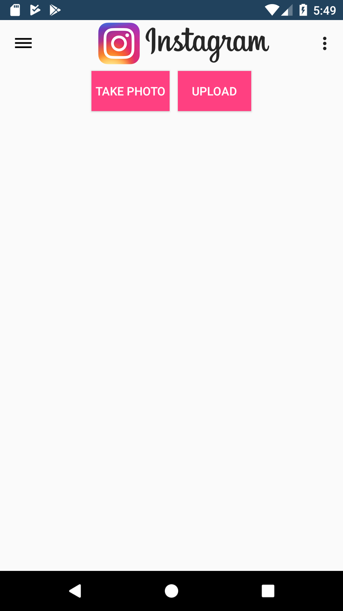
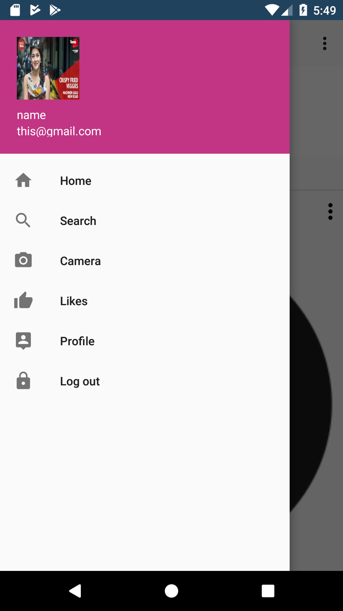
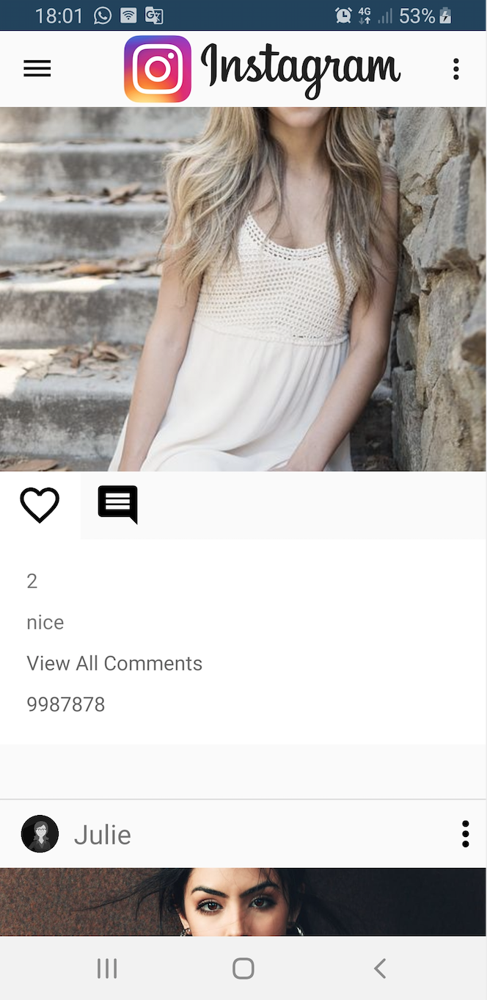

# instaClone
It has already implemented Sign up and  Sign in using remote server.
Fetch data of users from server likes ,following ,comment but on this for now just used dummy data. 
capture high quality image from camera and save in to local storage and save in remote server.

TODO  
Comment section, Profile section,Search section

